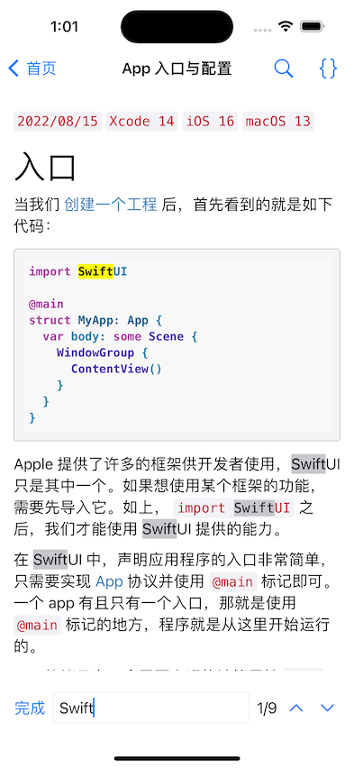
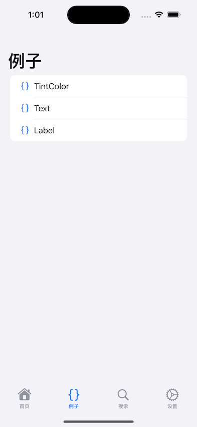
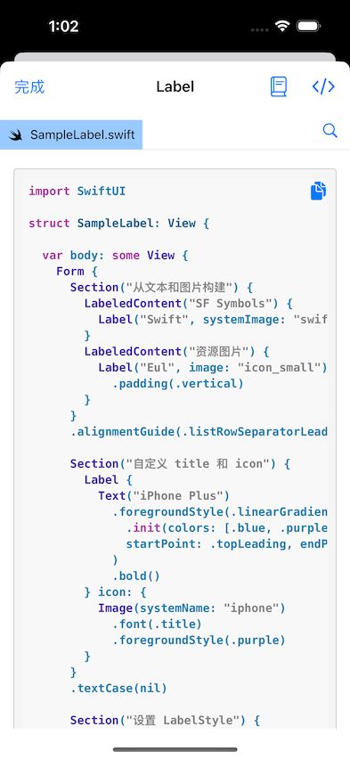
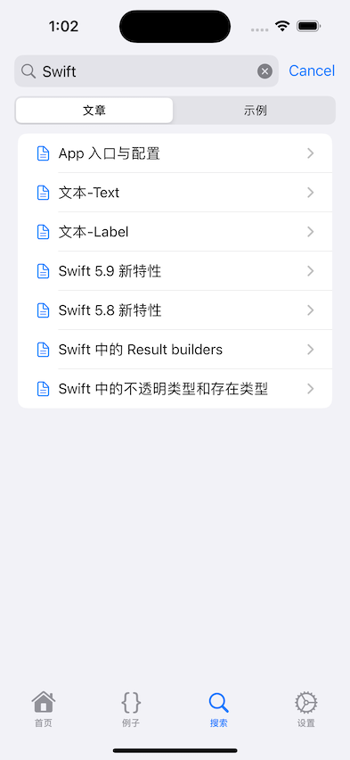
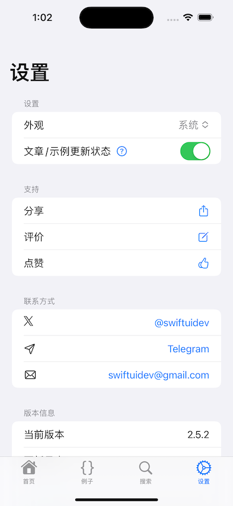
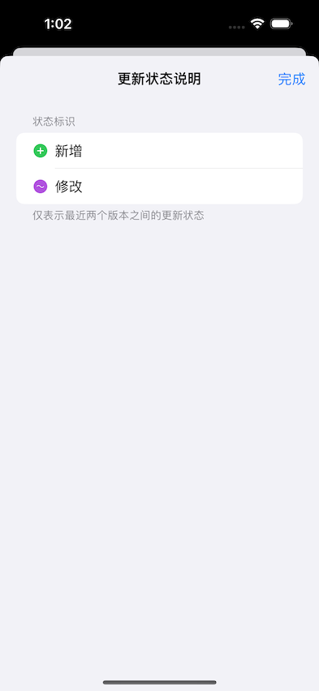

#  SwiftUIDev

## 介绍

SwiftUIDev是[Eul](https://apps.apple.com/cn/app/eul-swiftui-%E7%AE%80%E6%98%8E%E6%95%99%E7%A8%8B-%E5%B7%A5%E5%85%B7%E4%B9%A6/id1541991958)的一个复刻实现。
本项目仅供学习研究之用，Sample Code、Markdown和图片资源版权归原作者所有，不可用于分发和传播。

## 截图

